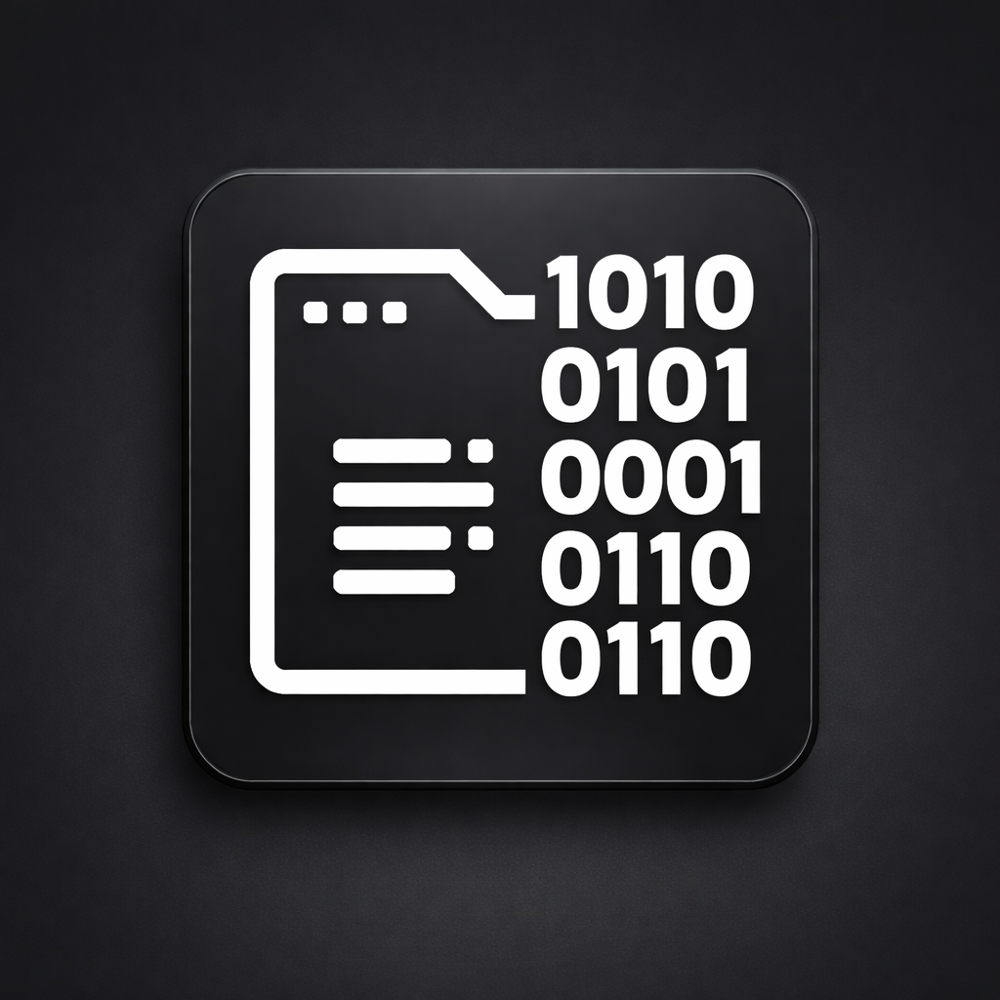

<div align="center">
  
  
  # 🚀 DBC Studio Pro | CAN Bus Reverse Engineering Suite
  
  **The Next-Generation AI-Powered CAN Bus Analyzer & DBC Database Generator**
  
  [](https://python.org)
  [](#)
  [](#)
  [](#)
  [](#)
  [](#)

  <p align="center">
    <br>
    <i>Stop guessing bits. Start discovering signals. DBC Studio Pro combines classic CAN bus protocol analysis with cutting-edge heuristic AI to automate your reverse engineering workflow. Built for automotive engineers, cybersecurity researchers, and performance tuners.</i>
  </p>
  <br>
</div>

---

## 🌟 Why DBC Studio Pro?

Traditional CAN tools (like Vector CANalyzer) cost thousands of dollars and rely purely on manual effort. **DBC Studio Pro** bridges the gap by bringing **Military-Grade Reverse Engineering (RE)** capabilities straight to your desktop, featuring an intuitive **Modern Premium GUI** and a dedicated **Heuristic AI Agent** that finds shifting signal patterns automatically.

Whether you're developing IoT vehicle tracking, modifying heavy machinery, or hacking military simulators, DBC Studio Pro cuts your analysis time from **weeks to hours**.

## 🔥 Core Features

### 🧠 1. AI-Powered "RE Scout" (Reverse Engineering Wizard)
- **Differential Analysis**: Automatically compare "Baseline" and "Action" CAN logs to instantly pinpoint precisely which bits flipped.
- **Smart Discoveries**: Heuristic algorithms detect *Counters, Checksums, Temperature Sensors, and Speed Signals* by analyzing bit-wave volatility over time.
- **Visual Bit Heatmap**: See live bit-toggling density visually overlaid on an 8x8 data matrix.

### 📜 2. Vector-Grade DBC Parsing & Generation
- **Full Standard Compliance**: Supports nodes, messages, multiplexed signals (MUX m0, m1, M), attributes, value tables, and standard Vector CANoe chunk ordering.
- **Complex Architectures**: Flawless handling of Intel (Little-Endian) / Motorola (Big-Endian) byte orders, unsigned, and signed Two's Complement encoding.
- **Zero Data Loss**: Ensures a 100% accurate file roundtrip (parse -> edit -> generate).

### 🎬 3. Video-Sync Analysis Workspace
- Synchronize your CAN `.csv` or `.asc` dumps with **external video files** (MP4, AVI). 
- Drag the slider to see exactly what bit changed the exact millisecond you turned the steering wheel or pressed a button on the video!

### 🎨 4. Premium "2026" Dark/Light UI Experience
- Built with PyQt5 but styled like a modern web app (Tailwind CSS colors, Drop Shadows, Floating Cards).
- **Responsive Workspace Cards**: A beautifully organized navigation workflow with dedicated views for Database Tree, Bit Layout Editing, and Data Tables.

### 🌍 5. Native Multi-Language Support
- The application is natively built to support multiple languages to accommodate global commercial engineering teams.
- Currently supports **English (ENG), Russian (RUS), and Turkmen (TKM)** natively integrated right into the app without requiring third-party translation layers.

---

## 📸 Screenshots

*(Replace with actual high-quality screenshots of the app!)*

| The Smart RE Scout (AI) | The DBC Signal Editor |
|:---:|:---:|
|  |  |

<br>

---

## ⚙️ Quick Start Installation

1. **Clone the repository:**
   ```bash
   git clone https://github.com/YourUsername/DBC-Studio-Pro.git
   cd DBC-Studio-Pro
   ```

2. **Create a virtual environment:**
   ```bash
   python -m venv venv
   source venv/bin/activate  # On Windows: .\venv\Scripts\activate
   ```

3. **Install Core Dependencies:**
   ```bash
   pip install PyQt5 ixxatpy candump2csv
   ```

4. **Launch the Professional GUI:**
   ```bash
   python main.py gui --dark
   ```

---

## 🏗️ Technical Architecture

The codebase is built cleanly with true separation of concerns, heavily audited for edge cases:

*   **`models.py`**: Object-Oriented representations of Signals, Messages, scaling, min/max domains, and Multiplexers.
*   **`parser.py` & `generator.py`**: Fully regex-powered parser logic capable of reading the toughest industry-grade `.dbc` files.
*   **`ai_module.py`**: Multi-ID bit-transition analysis logic measuring stability, variance, and entropy. 
*   **`ui/theme.py`**: Centralized stylesheet injector responsible for the sleek frontend aesthetics.

---

## 💼 Commercial & Enterprise Licensing

**DBC Studio Pro** is currently proprietary software. 
If you are an Automotive Firm, Hardware Engineering company, or Security Research Team looking to purchase a commercial license, integrate this into your workflow, or request custom ECU-specific features:

📫 **Contact the Developer:** `your.email@example.com` <br>
🌍 **Portfolio / Website:** `https://yourdomain.com`

---

<div align="center">
  <b>Built with ❤️ (and a lot of CAN bus logs) by The Developer.</b>
</div>
